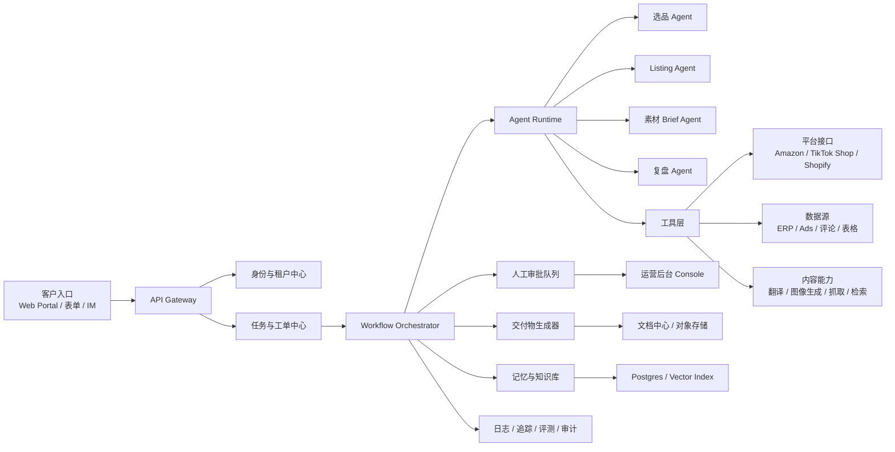

# AI 跨境电商数字员工产品设计方案

日期: 2026-04-10

## 1. 结论摘要

在以下前提下:

- 现有资源优势集中在跨境卖家
- 前 12 个月优先追求现金流和结果交付
- 可接受半产品半服务模式

最优切入方向不是通用型“AI 数字员工平台”，而是垂直岗位型产品:

**AI 跨境选品与上新员工**

第一阶段的产品目标不是替代整家公司，而是替代卖家团队中最容易标准化、最能被量化、最容易证明 ROI 的岗位链路:

- 选品研究
- Listing 生成
- 素材 Brief 生成
- 上新复盘

这条路径兼具四个优势:

1. 需求真实且高频
2. 价值容易和人力成本、上新速度、投放效率挂钩
3. 更适合通过“半产品半服务”快速拿到首批付费客户
4. 后续可以自然向广告、客服、经营分析和财税方向扩展

## 2. 为什么不先做其他方向

### 2.1 方案 A: 通用 AI 数字员工平台

优点:

- 想象空间大
- 后续可以覆盖多个岗位

问题:

- 价值主张过宽，首单难卖
- 和现有大模型 Agent 产品正面竞争
- 很难在前 90 天做出清晰且可复用的交付标准

### 2.2 方案 B: AI 财税员工

优点:

- 长期粘性高
- 付费意愿和留存通常更强

问题:

- 强合规、强信任、强责任
- 接口和数据闭环复杂
- 不适合在缺乏财税交付背书时快速切入

### 2.3 方案 C: AI 设计员工

优点:

- 演示效果好
- 交付边界相对清晰

问题:

- 容易被通用模型和设计工具压价
- 单独做成产品时壁垒不够深
- 更适合作为电商产品中的能力模块

### 2.4 方案 D: AI 知识博主员工

优点:

- 低门槛
- 易做传播

问题:

- 客单价和留存通常弱于电商岗位型产品
- 更适合做获客入口，不适合做第一主产品

### 2.5 推荐方案

**推荐先做岗位型、可交付、可审阅、可量化 ROI 的 AI 跨境选品与上新员工。**

## 3. 市场判断与外部信号

以下判断基于公开资料，并结合当前日期 2026-04-10 做出的推论:

- McKinsey 在 2025-06 发布的 agentic AI 相关研究强调，真正落地利润表的往往不是横向聊天助手，而是嵌入业务流程的垂直 agent。
- Shopify 官方持续推进 `Sidekick` 和 `Shopify Magic`，说明通用商家 AI 辅助能力正在平台化，独立创业者更应切入结果导向、岗位导向、跨平台导向的场景。
- Adobe 的 2025 AI and Digital Trends 报告显示，AI 使用已经从实验性内容生成，进一步走向更完整的执行工作流。
- Intuit 在 2024-09-25 的公开材料中明确提出 small business 的 “done-for-you future with agentic AI”，说明“AI 代做”是有效产品方向，但财税相关路径会更依赖合规和责任体系。

这些信号共同支持一个结论:

**现在的机会不是再做一个更泛的 AI 助手，而是做一个能替代具体岗位产出的垂直执行系统。**

参考资料:

- McKinsey: <https://www.mckinsey.com/capabilities/quantumblack/our-insights/seizing-the-agentic-ai-advantage>
- Shopify Sidekick: <https://help.shopify.com/en/manual/shopify-admin/productivity-tools/sidekick>
- Shopify Magic: <https://help.shopify.com/en/manual/shopify-admin/productivity-tools/shopify-magic>
- Adobe 2025 AI and Digital Trends: <https://business.adobe.com/content/dam/dx/us/en/resources/digital-trends-report-2025/2025_Digital_Trends_Report.pdf>
- Intuit 2024-09-25: <https://investors.intuit.com/_assets/_438eee0278d1714ce7a405cc2b890635/intuit/news/2024-09-25_Intuit_Pioneers_Done_for_You_Future_for_Consumers__1214.pdf>
- Accio Work: <https://www.accio.com/wow/guide-accio-work-vs-chatgpt.html>

## 4. 目标用户与切入市场

### 4.1 核心 ICP

优先客户:

- 5 到 30 人团队的跨境卖家
- 已有稳定订单和既有 SKU
- 每月有持续上新需求
- 存在明确的商品运营和内容生产压力

优先平台:

- Amazon
- TikTok Shop
- Shopify 独立站

优先类目:

- 家居
- 宠物
- 户外
- 3C 配件
- 日用品

暂缓类目:

- 保健品
- 医疗相关
- 强监管儿童类
- 强功效宣称品类

### 4.2 关键痛点

1. 上新效率低，依赖人工找品、调研、写 Listing、对接设计
2. 团队中很多人做的是低复用、重复性的资料整理和包装工作
3. 爆品模仿和市场变化快，错过上新窗口的成本高
4. 运营和设计之间协作割裂，信息来回传递损耗大
5. 数据分散在 ERP、广告后台、店铺后台、表格和聊天工具中

### 4.3 用户真正购买的东西

用户购买的不是“模型能力”，而是:

- 更快的上新节奏
- 更稳定的素材产出
- 更低的人力依赖
- 更标准化的上新交付
- 可追踪的运营建议

## 5. 产品定位

### 5.1 一句话定位

**给跨境卖家配一个 AI 商品运营员工，负责选品分析、上新资料生成、素材 Brief 和复盘建议。**

### 5.2 产品边界

第一阶段做:

- 从数据和竞品中找候选上新机会
- 生成可审阅的商品上新包
- 生成可交付给设计或视频团队的素材 Brief
- 根据销量、广告、评价做周复盘和动作建议

第一阶段不做:

- 全自动投放
- 无人审核直接改店铺
- 财税申报或合规决策
- 通用聊天助手
- 自由开放式自动化平台

### 5.3 北极星指标

**每个客户每月被采纳并上线的 AI 交付包数量**

辅助指标:

- 从需求提出到上新包产出的平均时长
- 上新周期缩短比例
- 每客户每月节省工时
- 试点转续费率
- 每周 AI 推荐被采纳率

## 6. 产品方案设计

### 6.1 方案形态

第一阶段采用三层交付:

1. `Agent workflow`
2. `人工审核与编辑`
3. `标准化交付包`

这意味着用户体验不是“聊一句话，然后什么都自动完成”，而是:

1. 提交任务
2. AI 拉取上下文和数据
3. 生成候选结果
4. 人工审核关键风险点
5. 向客户交付正式上新包
6. 记录客户采纳和效果反馈

### 6.2 MVP 核心模块

#### 模块 1: 选品扫描

输入:

- 店铺历史销量
- 目标价格带
- 品类限制
- 竞品链接
- 毛利要求

输出:

- 候选 SKU 清单
- 竞争强度判断
- 毛利测算
- 风险提示
- 推荐优先级

#### 模块 2: Listing 上新包生成

输入:

- SKU 基础资料
- 平台要求
- 品牌风格
- 目标站点语言

输出:

- 标题
- 五点描述
- 长描述
- 搜索关键词建议
- 平台适配字段
- 禁用词和风险提示

#### 模块 3: 素材 Brief 生成

输入:

- 商品卖点
- 用户画像
- 竞品素材
- 平台规范

输出:

- 主图脚本
- A+ 页面结构
- 短视频脚本
- UGC 内容方向
- 设计需求单

#### 模块 4: 周复盘

输入:

- 销量
- 广告数据
- 评论和问答
- 库存

输出:

- 本周问题列表
- 影响因子判断
- 下周动作建议
- 紧急处理事项

### 6.3 非功能要求

- 结果必须可审阅、可追踪、可回滚
- 所有 AI 输出必须附带来源和上下文引用
- 高风险动作必须经过人工审批
- 支持多租户隔离
- 支持模板化交付和客户品牌记忆

## 7. 商业模式与服务包装

### 7.1 推荐收费方式

`试点包`

- 周期: 4 周
- 定价: 人民币 9,800 到 29,800
- 交付: 固定数量选品分析、上新包和周报

`标准订阅`

- 周期: 月付
- 定价: 人民币 8,000 到 20,000
- 交付: 固定频次交付包 + 周会 + 审批服务

`高级版本`

- 定价: 人民币 30,000+
- 适合有多个站点和平台的卖家
- 含定制流程、专属运营顾问、更多系统接入

### 7.2 为什么不先做纯 SaaS

- 客户对新型 Agent 产品信任不足
- 数据接入和流程适配差异大
- 真正高价值部分在于“代做”而不是“可用”
- 早期最重要的是沉淀模板、流程和行业 know-how

## 8. 系统架构设计

### 8.1 架构目标

系统需要同时满足三件事:

1. 能快速交付客户结果
2. 能把重复流程逐步产品化
3. 能控制 AI 输出风险和人工审核成本

### 8.2 总体架构

### 8.3 分层说明

#### 8.3.1 交互层

组成:

- 客户 Web Portal
- 内部运营后台
- IM 或邮件通知

职责:

- 提交任务
- 查看候选结果
- 审批或退回修改
- 下载交付物
- 查看周报和历史记录

#### 8.3.2 业务应用层

核心服务:

- `Tenant Service`
- `Task Service`
- `Approval Service`
- `Artifact Service`
- `Report Service`

职责:

- 管理客户组织、品牌、站点、权限
- 保存任务状态机
- 组织审批流程
- 统一输出交付物格式
- 提供运营报表和客户可视化

#### 8.3.3 Workflow 编排层

推荐用工作流引擎或事件驱动任务系统实现:

- `workflow definitions`
- `job queue`
- `retry / timeout / compensation`
- `human-in-the-loop pause`

职责:

- 将一个业务任务拆解成多个 Agent 子任务
- 控制工具调用顺序
- 记录中间结果和失败点
- 在高风险节点等待人工审核

#### 8.3.4 Agent Runtime 层

建议按岗位职责拆 Agent，而不是按模型拆:

- `Research Agent`: 竞品、评论、趋势、关键词收集
- `Scoring Agent`: 对候选品做排序和风险评分
- `Listing Agent`: 生成平台适配文案
- `Creative Brief Agent`: 生成主图、A+、视频脚本
- `Review Agent`: 做格式、政策、禁词、逻辑校验
- `Analytics Agent`: 基于销量和广告做复盘建议

关键原则:

- 每个 Agent 只负责一个清晰任务
- 输出必须结构化
- 每次执行都保留上下文和版本号

#### 8.3.5 工具与集成层

平台接口:

- Amazon SP-API
- TikTok Shop Open API
- Shopify Admin API
- 广告平台 API

第三方能力:

- 爬取与搜索
- 翻译
- 图像生成
- OCR
- 文档解析

内部工具:

- 模板渲染
- 合规规则检查
- 定价和毛利计算器
- Prompt 模板服务

#### 8.3.6 数据层

建议数据存储拆为四类:

- `Postgres`: 业务主数据
- `Object Storage`: 交付包、原始文件、截图、文档
- `Cache / Queue`: 实时任务和性能优化
- `Vector / Search Index`: 品牌知识、历史交付、竞品知识、政策规则

核心数据实体:

- Tenant
- User
- BrandProfile
- MarketplaceAccount
- ProductCandidate
- ListingTask
- CreativeBrief
- ReviewReport
- ApprovalRecord
- WeeklyInsight
- ArtifactVersion

### 8.4 关键业务流程

#### 流程 1: 选品扫描

1. 客户提交扫描需求
2. 系统拉取品牌配置、历史站点数据和类目约束
3. Research Agent 收集竞品、评论、价格、关键词
4. Scoring Agent 计算机会分和风险分
5. Review Agent 输出标准候选清单
6. 人工审核后交付客户

#### 流程 2: 上新包生成

1. 客户选定候选 SKU
2. Listing Agent 生成平台适配文案
3. Creative Brief Agent 生成素材需求和脚本
4. Review Agent 做结构和规则检查
5. 人工修订高风险字段
6. 生成可下载交付包

#### 流程 3: 周复盘

1. 系统定时拉取销量、广告、评价、库存
2. Analytics Agent 识别异常与变化
3. 生成周报草稿
4. 运营审核重点建议
5. 推送给客户并记录采纳情况

### 8.5 风险控制架构

高风险输出必须经过三层控制:

1. `规则层`
   - 平台禁词
   - 合规词库
   - 长度和格式限制

2. `模型层`
   - 自检 Prompt
   - 双模型复核
   - 结构化字段校验

3. `人工层`
   - 敏感品类人工审批
   - 首批客户全量人工复核
   - 异常结果回滚

### 8.6 为什么这个架构适合早期创业

- 可先用人工接管复杂节点，不要求一开始全自动
- 交付物中心化，利于模板沉淀和复用
- Agent 与业务服务分层，后续可逐步替换实现
- 数据和审计链路清晰，适合以后扩展到广告、客服、财税

## 9. 建议技术栈

### 9.1 推荐组合

- 前端: Next.js
- 后端 API: FastAPI 或 NestJS
- 工作流编排: Temporal / LangGraph / 自建任务编排
- Agent Runtime: 基于多 Agent 编排框架实现
- 主库: Postgres
- 缓存与队列: Redis
- 对象存储: S3 兼容存储
- 检索: pgvector 或独立向量库
- 监控: OpenTelemetry + Langfuse 或 LangSmith

### 9.2 适合当前阶段的实现建议

若追求首单速度:

- API + Postgres + Redis + 对象存储
- 一套稳定工作流编排
- 少量专用 Agent
- 强人工审核

先不要过度建设:

- 自研模型平台
- 通用插件市场
- 复杂多租户权限矩阵
- 低价值可视化大屏

## 10. 90 天落地计划

### 第 1 阶段: 0 到 30 天

目标:

- 完成客户验证
- 拿到首批付费试点
- 跑通人工 + AI 混合交付

动作:

- 深访 20 个跨境卖家
- 签 3 到 5 个付费试点
- 确定 1 到 2 个优先平台和 2 个优先类目
- 固化交付模板:
  - 选品分析模板
  - Listing 包模板
  - 素材 Brief 模板
  - 周报模板

阶段验收:

- 至少 3 个愿意付费试点的客户
- 至少 1 个客户连续 4 周使用

### 第 2 阶段: 31 到 60 天

目标:

- 产品化高频环节
- 降低单次交付的人力成本

动作:

- 上线任务中心
- 上线品牌记忆与模板系统
- 上线第一版 Agent workflow
- 支持标准交付物导出
- 支持人工审批流和版本回溯

阶段验收:

- 交付时长下降 30%
- 单客户月度交付可重复执行

### 第 3 阶段: 61 到 90 天

目标:

- 从“项目制”过渡到“订阅制”
- 建立续费和案例

动作:

- 接入 1 到 2 个平台 API
- 自动拉取基础经营数据
- 上线周复盘模块
- 做客户案例和销售材料
- 形成按类目和平台区分的 SOP

阶段验收:

- 试点转订阅率达到预期
- 至少 2 个可对外讲述的案例

## 11. 组织与人员配置

早期最小配置建议:

- 1 名产品/创始人
- 1 名全栈工程师
- 1 名电商运营专家
- 1 名交付/客户成功

如果资源更少，可以先用 2 人启动:

- 创始人兼销售和产品
- 1 名工程师兼自动化和交付支持

但必须外接行业运营顾问，否则很容易做成“技术正确、业务没价值”的系统。

## 12. 成功指标

### 12.1 业务指标

- 首月签约客户数
- 试点转长期订阅率
- 客单价
- 毛利率

### 12.2 产品指标

- 单个交付包平均生成时长
- 交付包通过率
- 人工修改率
- 客户采纳率

### 12.3 经营指标

- 每客户月活跃任务数
- 周报查看率
- 推荐动作执行率
- 续费率

## 13. 关键风险与应对

### 风险 1: 价值主张过宽

应对:

- 第一阶段只卖“选品与上新员工”

### 风险 2: AI 输出质量不稳定

应对:

- 强模板
- 强结构化
- 强审核

### 风险 3: 客户数据接入困难

应对:

- 先支持表格和手工导入
- 再做 API 接入

### 风险 4: 交付过于依赖人工，无法扩张

应对:

- 只产品化高频重复链路
- 对异常长尾场景维持人工兜底

### 风险 5: 被平台内置 AI 替代

应对:

- 做跨平台流程
- 做品牌记忆
- 做交付闭环
- 做人工审核和行业 know-how

## 14. 后续路线图

### Phase 1

AI 跨境选品与上新员工

### Phase 2

AI 广告素材与活动运营员工

### Phase 3

AI 客服与复购员工

### Phase 4

AI 经营分析与利润助手

### Phase 5

在具备数据、信任和流程基础后，再考虑 AI 财税员工

## 15. 最终建议

在你当前的资源结构下，最佳路径是:

1. 不做泛平台，先做垂直岗位产品
2. 不先追求纯 SaaS，先做高价值交付
3. 把知识博主能力作为获客渠道，而不是主产品
4. 把设计能力和内容能力作为交付引擎，而不是独立赛道
5. 先切跨境卖家的“选品与上新”这条高频、可量化、可复用的链路

一句话总结:

**先卖“结果型数字员工”，再逐步长成“平台型数字员工系统”。**
