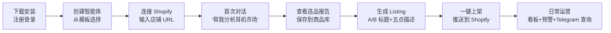
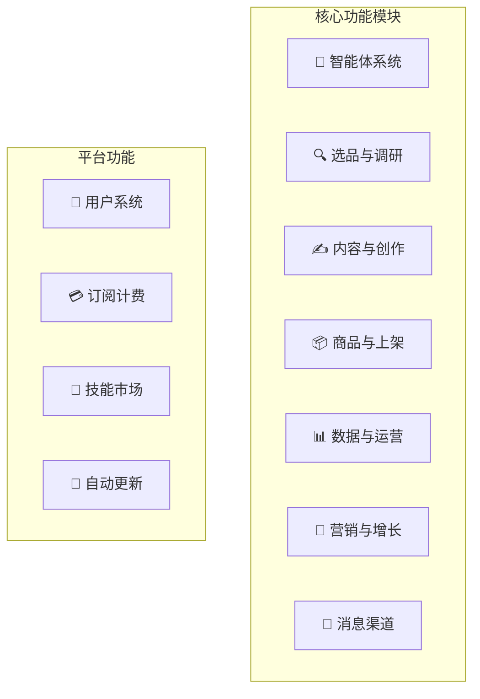
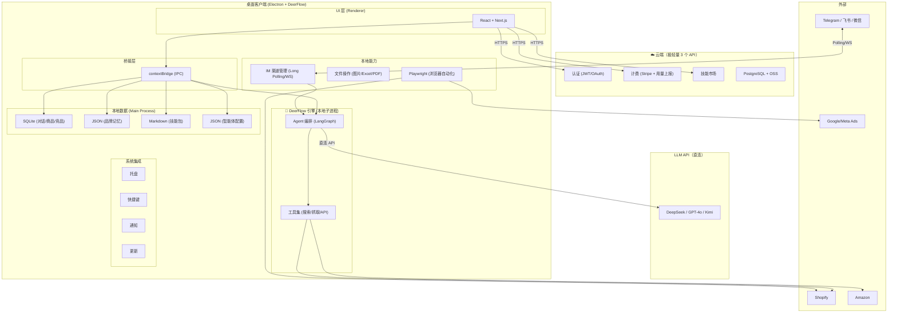
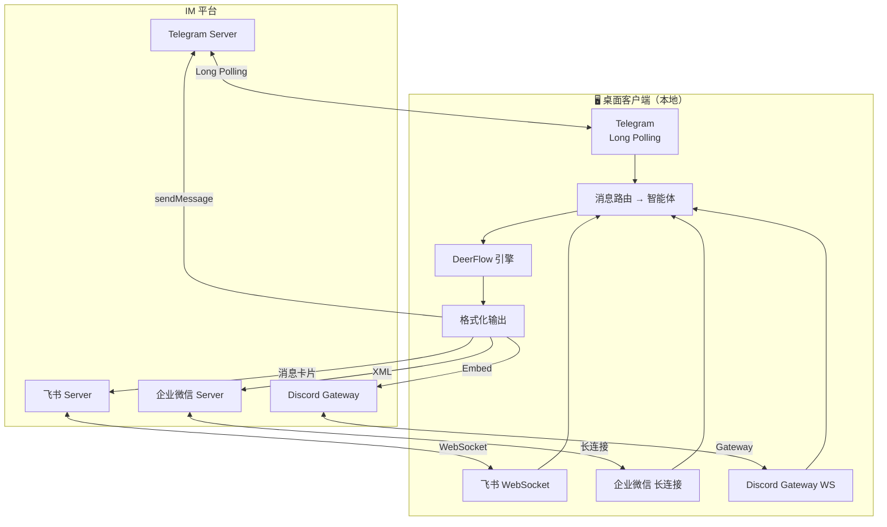
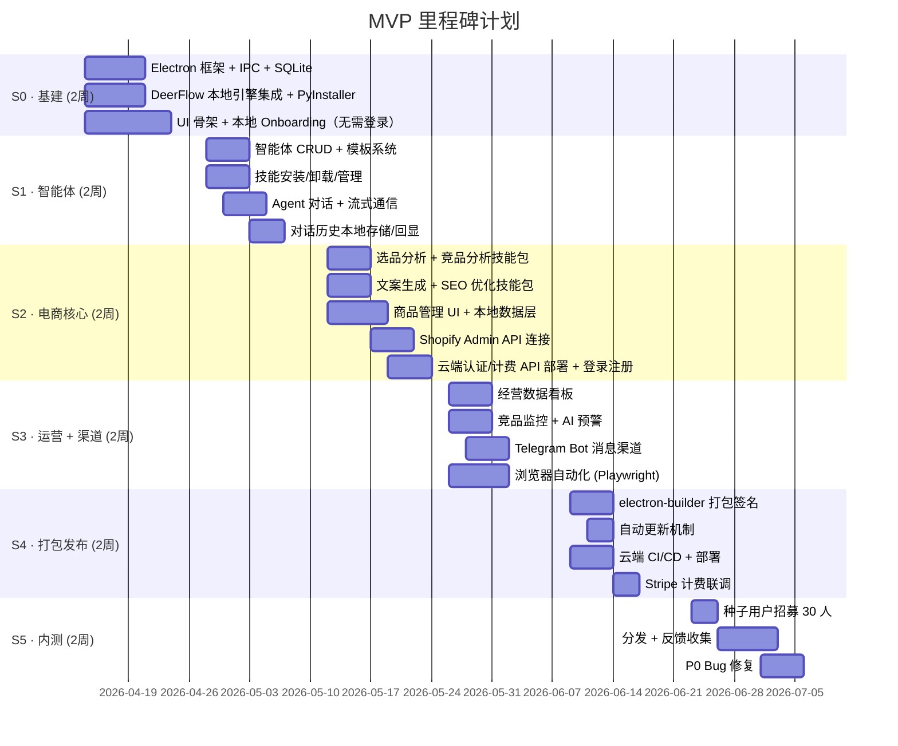

# 产品需求文档 (PRD)
# 跨境电商 AI 数字员工

| 字段 | 内容 |
|:---|:---|
| **文档版本** | v1.1 |
| **创建日期** | 2026-04-10 |
| **产品名称** | 待定（暂称 SuperShop） |
| **产品形态** | Electron 桌面客户端（内嵌 DeerFlow 引擎）+ 极轻量云端 |
| **目标用户** | 跨境电商独立站卖家 |
| **首发平台** | Shopify |
| **技术底座** | DeerFlow Agent 引擎（本地运行） |

---

## 一、产品概述

### 1.1 产品愿景

> **让每个跨境卖家拥有一支"随叫随到"的 AI 运营团队。**

SuperShop 是一款面向跨境电商独立站卖家的**桌面端 AI 数字员工平台**。用户可以创建多个各司其职的 AI 智能体（选品专员、内容专员、上架专员等），每个智能体装载不同的"技能包"，模拟真实运营团队的协作分工，帮助卖家实现**一人电商**。

### 1.2 核心价值主张

| 痛点 | 解决方案 |
|:---|:---|
| 个人卖家缺乏运营团队 | 6 类 AI 智能体替代选品/文案/上架/数据/客服/营销岗位 |
| 操作分散在多个平台 | 一个窗口统管 Shopify/Amazon/TikTok Shop |
| AI 工具无法操作平台后台 | 桌面端内嵌浏览器自动化，可直接操作 1688/Ads 等 |
| 数据隐私担忧 | 对话/记忆/技能存储在本地，数据不上云 |
| 不在电脑前无法操作 | 通过 Telegram/飞书/微信等 IM 远程与智能体交互 |


---

## 二、目标用户

### 2.1 核心用户画像

| 画像 | 描述 | 核心需求 |
|:---|:---|:---|
| **Shopify 品牌独立站** | 月 GMV $5K-$50K，1-3 人团队 | 文案矩阵 + SEO + 多语言 |
| **Amazon FBA 卖家** | 运营 3-20 个 SKU | 选品分析 + Listing 优化 + 竞品监控 |
| **副业电商人群** | 全职工作 + 副业电商 | 移动端触达 + 自动化 + 省时 |
| **小型代运营公司** | 管理 3-10 个品牌 | 多智能体 + 多店铺管理 |
| **TikTok Shop 新卖家** | 从短视频到电商转型 | 短视频脚本 + 快速上架 |

### 2.2 用户旅程（核心场景）



---

## 三、功能需求

### 3.1 功能需求总览



### 3.2 模块一：智能体系统

#### FR-1.1 智能体管理

| 需求 ID | 功能点 | 优先级 | 描述 |
|:---|:---|:---:|:---|
| FR-1.1.1 | 创建智能体 | P0 | 从 6 个预置模板一键创建，或自定义新建 |
| FR-1.1.2 | 配置智能体 | P0 | 编辑名称、角色、头像、AI 模型、自主程度 |
| FR-1.1.3 | 删除智能体 | P0 | 删除智能体及其绑定的技能/渠道配置 |
| FR-1.1.4 | 智能体状态 | P0 | 就绪 / 执行中 / 暂停 三种状态切换 |
| FR-1.1.5 | AI 模型选择 | P0 | 每个智能体可独立选择 DeepSeek / GPT-4o / Kimi |
| FR-1.1.6 | 自主程度调节 | P1 | 0-100% 滑块，控制自主执行 vs 人工确认的阈值 |

#### FR-1.2 技能管理

| 需求 ID | 功能点 | 优先级 | 描述 |
|:---|:---|:---:|:---|
| FR-1.2.1 | 安装技能 | P0 | 从技能市场下载 ZIP 到本地 skills/ 目录 |
| FR-1.2.2 | 卸载技能 | P0 | 从智能体的技能槽移除技能 |
| FR-1.2.3 | 技能推荐 | P1 | 根据智能体角色自动推荐适合的技能 |
| FR-1.2.4 | 本地自定义技能 | P1 | 用户编写 SKILL.md 放入 skills/ 目录即生效 |
| FR-1.2.5 | 技能版本更新 | P2 | 技能市场发布新版时提示更新 |

#### FR-1.3 预置智能体模板

| 模板 | 角色 | 预装技能 |
|:---|:---|:---|
| 🔍 选品专员 | 市场分析师 | `product-research` `competitor-analysis` `trend-discovery` |
| ✍️ 内容专员 | 文案/SEO 专家 | `copywriting` `seo-optimizer` `multi-language` |
| 📦 上架专员 | 运营助理 | `shopify-connector` `product-publisher` `image-processor` |
| 📊 数据专员 | 数据分析师 | `sales-analytics` `ad-performance` `profit-calculator` |
| 💬 客服专员 | 客服代表 | `customer-reply` `order-tracker` `review-manager` |
| 📢 营销专员 | 增长经理 | `ad-optimizer` `email-marketing` `social-content` |

---

### 3.3 模块二：选品与调研

| 需求 ID | 功能点 | 优先级 | 描述 |
|:---|:---|:---:|:---|
| FR-2.1 | 智能选品 | P0 | 输入品类/关键词 → 生成市场概况 + 细分机会 + 利润评估 |
| FR-2.2 | 竞品分析 | P0 | 输入竞品 URL → 抓取价格/评分/评论/卖点 → 生成差异化建议 |
| FR-2.3 | 竞品追踪 | P1 | 持续监控已添加竞品的价格/评分变化，异常时通知 |
| FR-2.4 | 趋势发现 | P1 | 基于 Google Trends + 社媒信号发现新兴品类 |
| FR-2.5 | 供应商搜索 | P2 | 通过 Playwright 浏览器自动化搜索 1688 供应商 |
| FR-2.6 | 利润计算器 | P1 | 输入成本/售价/运费 → 计算毛利率/ROI/盈亏平衡点 |

**输出格式**：结构化卡片式报告，支持 [导出 PDF] [保存到商品库] [深入分析] 操作。

---

### 3.4 模块三：内容与创作

| 需求 ID | 功能点 | 优先级 | 描述 |
|:---|:---|:---:|:---|
| FR-3.1 | Listing 文案 | P0 | 标题 A/B 版 + 五点描述 + 详情页文案 + SEO Meta |
| FR-3.2 | SEO 优化 | P0 | 关键词建议 + Meta 标签生成 + 搜索排名预估 |
| FR-3.3 | 多语言翻译 | P1 | 英/日/韩/西/法/德，本地化翻译（非直译） |
| FR-3.4 | 图片描述 | P2 | 根据产品图生成 alt text 和营销描述 |
| FR-3.5 | 短视频脚本 | P2 | 30 秒 TikTok/YouTube Shorts 带货脚本 |
| FR-3.6 | 邮件营销模板 | P2 | 上新邮件/促销邮件/弃购挽回邮件模板 |
| FR-3.7 | 品牌调性记忆 | P0 | 记住品牌风格/目标受众/价位/调性，所有内容保持一致 |

---

### 3.5 模块四：商品与上架

| 需求 ID | 功能点 | 优先级 | 描述 |
|:---|:---|:---:|:---|
| FR-4.1 | 商品库 | P0 | 本地 SQLite 存储商品信息（名称/SKU/售价/成本/图片/文案） |
| FR-4.2 | 添加商品 | P0 | 手动添加 / 从选品报告保存 / Excel 批量导入 |
| FR-4.3 | 商品详情 | P0 | 查看/编辑商品 + 关联竞品对比 + AI 操作入口 |
| FR-4.4 | Shopify 连接 | P0 | Shopify Admin API 连接，OAuth 认证 |
| FR-4.5 | 一键上架 | P0 | 商品信息 → API 推送至 Shopify（标题/描述/价格/图片） |
| FR-4.6 | 同步状态 | P1 | 显示商品在各平台的上架状态 + 商品 ID 关联 |
| FR-4.7 | 批量操作 | P1 | Excel 导入 / 批量改价 / 批量生成文案 |
| FR-4.8 | Amazon 连接 | P2 | Amazon SP-API 商品管理 |
| FR-4.9 | TikTok 连接 | P2 | TikTok Shop API 商品管理 |

---

### 3.6 模块五：数据与运营

| 需求 ID | 功能点 | 优先级 | 描述 |
|:---|:---|:---:|:---|
| FR-5.1 | 经营看板 | P1 | GMV / 订单数 / 访客数 / 转化率，支持今日/本周/本月/自定义 |
| FR-5.2 | 热销 Top 5 | P1 | 按销售额排序的商品排行 |
| FR-5.3 | AI 预警 | P1 | 库存低 / 竞品降价 / 销量异常 → 系统通知 |
| FR-5.4 | 运营周报 | P2 | 每周自动生成经营报告 PDF |
| FR-5.5 | 销售趋势图 | P1 | 折线图展示 GMV/订单数趋势 |

---

### 3.7 模块六：营销与增长

| 需求 ID | 功能点 | 优先级 | 描述 |
|:---|:---|:---:|:---|
| FR-6.1 | 广告分析 | P2 | 浏览器自动化抓取 Google/Meta Ads 数据 → ROAS 分析 |
| FR-6.2 | 广告优化建议 | P2 | AI 建议提升/暂停广告组，一键应用需人工确认 |
| FR-6.3 | 社媒内容 | P2 | 自动生成 Instagram/TikTok 帖文 + 定时发布 |
| FR-6.4 | 评论管理 | P2 | 自动回复评论 + 差评关键词提取 + 情感分析 |

---

### 3.8 模块七：消息渠道

| 需求 ID | 功能点 | 优先级 | 描述 |
|:---|:---|:---:|:---|
| FR-7.1 | 渠道管理 | P1 | 添加/配置/暂停/删除消息渠道 |
| FR-7.2 | Telegram Bot | P1 | 创建 Bot → 输入 Token → 绑定智能体 → 对话 |
| FR-7.3 | 飞书集成 | P2 | 飞书开放平台应用 → 事件订阅 → @机器人对话 |
| FR-7.4 | 微信集成 | P2 | 企业微信 API / 公众号 → 消息回调 |
| FR-7.5 | Discord Bot | P2 | Discord Bot API → 频道对话 |
| FR-7.6 | Slack Bot | P2 | Slack Events API → 频道对话 |
| FR-7.7 | 渠道权限控制 | P0 | 每个渠道独立设置：允许查询 / 允许生成 / 允许发布 / 禁止支付 |
| FR-7.8 | 智能体切换 | P1 | `/switch <智能体名>` 指令切换当前对话的智能体 |
| FR-7.9 | 消息格式适配 | P1 | Markdown → Telegram HTML / 飞书消息卡片 / Slack Block Kit |

---

### 3.9 模块八：平台功能

| 需求 ID | 功能点 | 优先级 | 描述 |
|:---|:---|:---:|:---|
| FR-8.1 | 注册 | P0 | 邮箱 + 密码注册 |
| FR-8.2 | 登录 | P0 | 邮箱密码 + JWT Token 本地缓存 |
| FR-8.3 | OAuth 登录 | P1 | Google / GitHub 第三方登录 |
| FR-8.4 | 订阅管理 | P0 | 套餐选择 + Stripe 付款 + 用量查看 |
| FR-8.5 | 技能市场 | P2 | 浏览/搜索/下载技能包 |
| FR-8.6 | 自动更新 | P0 | electron-updater 推送新版本 + 增量更新 |
| FR-8.7 | 系统托盘 | P0 | 最小化到系统托盘 + 右键菜单 |
| FR-8.8 | 全局快捷键 | P1 | Alt+Space 唤起快速指令面板 |

---

## 四、系统架构

### 4.1 总体架构



> **架构理念**：DeerFlow 引擎 + IM 消息收发全部在本地运行，用户数据不出电脑。
> 云端仅保留认证、计费、技能市场 3 个无状态 API，可部署在 1C1G 最低配机器上（月成本 < $10）。

### 4.2 数据分层策略

| 数据 | 存储位置 | 格式 | 理由 |
|:---|:---:|:---:|:---|
| 对话历史 | 🖥️ 本地 | SQLite | 隐私敏感，用户数据不上云 |
| 品牌记忆 | 🖥️ 本地 | JSON | 品牌调性是核心资产 |
| 智能体配置 | 🖥️ 本地 | JSON | 个性化配置，本地读写更快 |
| 技能包 | 🖥️ 本地 | Markdown | 从市场下载后本地安装运行 |
| 商品库 | 🖥️ 本地 | SQLite | 商品数据含成本等敏感信息 |
| 竞品追踪 | 🖥️ 本地 | SQLite | 竞争情报数据 |
| 平台凭证 | 🖥️ 本地 | 加密文件 | API Key 等敏感凭证 |
| **Agent 引擎** | 🖥️ **本地** | **二进制** | **DeerFlow 引擎本地运行，数据不出电脑** |
| **IM 渠道连接** | 🖥️ **本地** | **配置文件** | **Long Polling/WS 直连 IM 平台** |
| 用户账号 | ☁️ 云端 | PostgreSQL | 认证需要云端统一管理 |
| 订阅/用量 | ☁️ 云端 | PostgreSQL | 计费数据必须云端 |
| 技能市场目录 | ☁️ 云端 | PostgreSQL + OSS | 公共资源，云端分发 |

### 4.3 本地存储路径

```
~/.supershop/
├── data.db                    # SQLite 主数据库
├── memory/
│   ├── brand.json             # 品牌风格记忆
│   └── preferences.json       # 用户偏好
├── agents/
│   ├── agent-001.json         # 选品专员配置
│   ├── agent-002.json         # 内容专员配置
│   └── ...
├── skills/
│   ├── product-research/      # 选品分析技能
│   │   └── SKILL.md
│   ├── copywriting/           # 文案生成技能
│   │   └── SKILL.md
│   └── ...
├── credentials/
│   ├── shopify.enc            # Shopify API Key（加密）
│   └── ...
└── cache/                     # 临时缓存
```

### 4.4 消息渠道架构（全部本地）



> **无需云端**：所有 IM 采用客户端主动连接（Polling / WebSocket），不需要公网 Webhook 地址。IM 消息仅在桌面端运行时可收发。

---

## 五、非功能性需求

### 5.1 性能

| 指标 | 目标 |
|:---|:---|
| 应用启动时间 | < 5 秒（含引擎子进程启动） |
| SQLite 查询响应 | < 50ms（万级记录） |
| Agent 首字延迟 | < 2 秒（本地引擎 → LLM API） |
| 安装包大小 | < 250MB（含 DeerFlow 引擎二进制） |
| 内存占用 | < 500MB（含引擎空闲状态） |

### 5.2 安全

| 要求 | 实现方式 |
|:---|:---|
| 数据隐私 | 对话/记忆/技能/商品数据**全部本地存储** |
| 凭证安全 | Shopify API Key 等使用 AES-256 加密存储 |
| 传输安全 | 所有云端通信 HTTPS + JWT 认证 |
| 沙箱隔离 | Electron `contextIsolation: true` + `nodeIntegration: false` |
| 高风险操作 | 上架/改价/广告调整需**人工确认** |
| IM 渠道权限 | 支付操作**禁止**通过 IM 渠道触发 |
| Electron 安全 | Preload contextBridge 桥接，不暴露 Node API |

### 5.3 可用性

| 要求 | 描述 |
|:---|:---|
| 离线能力 | 无网络时可查看本地数据（对话历史/商品库/记忆） |
| Onboarding | 首次使用 4 步引导（选平台 → 连接 → 选模型 → 首次任务） |
| 错误处理 | 网络断开/API 限流/LLM 超时均有友好提示和重试 |
| 多语言 UI | MVP 为中英双语，后续扩展 |

---

## 六、定价策略

| 套餐 | Free | Pro | Business | Enterprise |
|:---|:---:|:---:|:---:|:---:|
| **月费** | $0 | $29 | $79 | $199 |
| **智能体数** | 1 | 3 | 不限 | 不限 + 定制 |
| **月对话次数** | 500 | 3,000 | 不限 | 不限 + SLA |
| **电商平台** | 1 个 | 2 个 | 不限 | 不限 + 私有部署 |
| **IM 渠道数** | - | 1 | 3 | 不限 |
| **技能来源** | 内置 | + 市场 | + API | + SDK + 定制 |

---

## 七、技能清单

| 类别 | 技能名称 | 交付方式 | 优先级 |
|:---|:---|:---:|:---:|
| **选品** | `product-research` 选品分析 | 内置 | P0 |
| | `competitor-analysis` 竞品分析 | 内置 | P0 |
| | `trend-discovery` 趋势发现 | 内置 | P1 |
| | `profit-calculator` 利润计算 | 市场 | P1 |
| | `supplier-finder` 供应商搜索 | 市场 | P2 |
| **内容** | `copywriting` 文案生成 | 内置 | P0 |
| | `seo-optimizer` SEO 优化 | 内置 | P0 |
| | `multi-language` 多语言翻译 | 内置 | P1 |
| | `image-description` 图片描述 | 市场 | P2 |
| | `video-script` 短视频脚本 | 市场 | P2 |
| **上架** | `shopify-connector` Shopify 连接 | 内置 | P0 |
| | `product-publisher` 商品上架 | 内置 | P0 |
| | `image-processor` 图片处理 | 市场 | P1 |
| | `amazon-connector` Amazon 连接 | 市场 | P2 |
| | `tiktok-connector` TikTok 连接 | 市场 | P2 |
| **营销** | `ad-optimizer` 广告优化 | 市场 | P2 |
| | `email-marketing` 邮件营销 | 市场 | P2 |
| | `social-content` 社媒内容 | 市场 | P2 |
| **运营** | `sales-analytics` 销售分析 | 内置 | P1 |
| | `customer-reply` 客服回复 | 市场 | P2 |
| | `review-manager` 评论管理 | 市场 | P2 |
| | `order-tracker` 订单追踪 | 市场 | P2 |

---

## 八、里程碑计划

### 8.1 MVP 交付（12 周）



### 8.2 MVP 首发功能清单

```
✅ P0 (必须交付)
├── 智能体: 创建/配置/模板/技能装卸
├── 选品专员: product-research + competitor-analysis
├── 内容专员: copywriting + seo-optimizer
├── 商品管理: 本地商品库 CRUD
├── Shopify 上架: Admin API 一键推送
├── 对话历史 + 品牌记忆 (本地)
├── ⚡ S0-S1 阶段无需登录，纯本地可用
└── 登录/注册/订阅 (S2 末尾接入)

⬜ P1 (尽量交付)
├── 消息渠道: Telegram Bot 集成
├── 多语言翻译
├── 经营数据看板
├── 趋势发现
├── 利润计算器
└── Excel 批量导入

⬜ P2 (内测后迭代)
├── 消息渠道: 飞书/微信/Discord/Slack
├── 广告优化 (Google/Meta)
├── 客服自动化
├── Amazon/TikTok 连接器
├── 评论管理
├── 社媒内容生成
└── 技能市场
```

### 8.3 Post-MVP 路线图

| 阶段 | 时间 | 重点 |
|:---|:---|:---|
| **V1.1** | MVP + 4 周 | 飞书/微信渠道 + 多语言 + 看板完善 |
| **V1.2** | MVP + 8 周 | Amazon 连接器 + 广告分析 + 技能市场 Beta |
| **V2.0** | MVP + 16 周 | TikTok Shop + 客服自动化 + 团队版（多用户） |

---

## 九、风险与应对

| 风险 | 概率 | 影响 | 应对措施 |
|:---|:---:|:---:|:---|
| Shopify API 限流 | 中 | 高 | 实现请求队列 + 指数退避 + 本地缓存 |
| LLM 幻觉导致错误建议 | 中 | 高 | 高风险操作强制人工确认 + 输出前置声明"AI 建议" |
| Electron 包体积过大 | 低 | 中 | 使用 Standalone 模式精简 + 延迟加载 Playwright |
| 竞品价格战 | 中 | 中 | 持续深耕 DTC 垂直场景 + 社区护城河 |
| 用户数据丢失 | 低 | 高 | SQLite 定时自动备份 + 可选云端加密同步（V2） |
| IM 平台政策变更 | 中 | 中 | IM 渠道管理器抽象层，快速切换协议实现 |
| 引擎打包体积 | 中 | 中 | PyInstaller 优化 + 按平台分发 + 排除无用依赖 |
| 桌面端离线时 IM 不可用 | 高 | 低 | 系统托盘常驻 + 消息积压后恢复处理 |

---